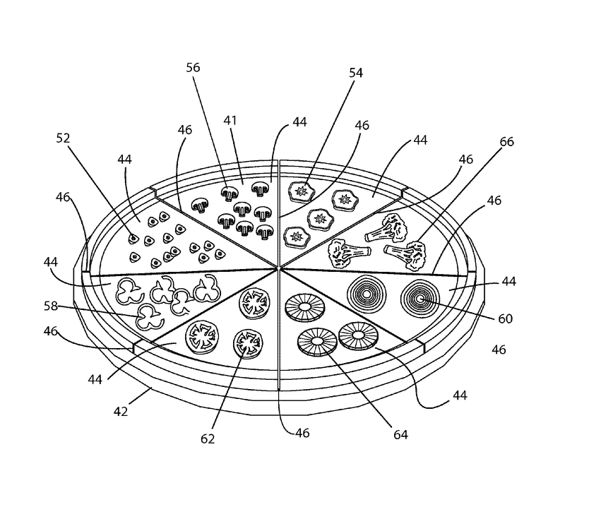

# Abstract

中文測試

Pizza (@pizza2000identification) is an understudied yet widely utilized implement for delivering in-vivo *Solanum lycopersicum* based liquid mediums in a variety of next-generation mastications studies. Here we describe a de novo approach for large scale *T. aestivum* assemblies based on protein folding that drastically reduces the generation time of the mutation rate.

# Diagram

# Algorithm

$$f(x)=pizza^2$$

# References